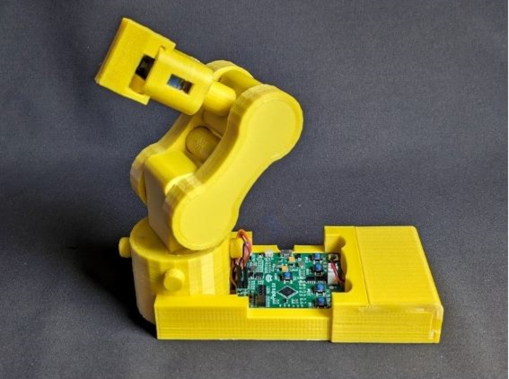

# Pedro-Get-Started

Welcome to the world of Pedro, the open-source robotics platform designed to make learning robotics, programming, and embedded electronics fun and accessible! Whether you’ve purchased a preassembled Pedro or you're building your own, here’s everything you need to get started.

---

# 🛠️ What You Need

## ✅ If You Purchased a Preassembled Pedro:

    

- 1x Pedro Robot including:
  - Rev2 or Rev3 Board 
  - 7.4V DC Battery
  - Modules: NRF24L01, OLED 128x64, ESP8266-01 (only Rev3), Bluetooth HC-05 (only Rev3)
  - Micro USB cable
- A PC with Arduino IDE installed

## ✅ If You’re Building Pedro Yourself:

    

- 3D-printed parts (STL files availables on [Pedro GitHub Page](https://github.com/almtzr/Pedro/tree/main/stl/kickstarter_version))
- Pedro Rev2 or Rev3 PCB (Gerber files available on [Pedro GitHub Page](https://github.com/almtzr/Pedro/tree/main/gerber))
- Servo motors (MG90S 360° not 180°)
- 7.4V DC Battery & charger
- Modules: NRF24L01, OLED 128x64, ESP8266-01 (only Rev3), Bluetooth HC-05 (only Rev3)
- Micro USB cable
- A PC with Arduino IDE installed

---

## ⚙️ 1. Assembling Pedro

(If you have a preassembled Pedro, skip to Step 2)

1️⃣ 3D print the parts (STL files available on GitHub)
2️⃣ Assemble the components (no screws, no glue—just plug & play 🛠️)
3️⃣ Attach the servo motors and connect them to the Pedro board
4️⃣ Install the modules (NRF, ESP8266, Bluetooth, OLED)
5️⃣ Plug in the battery and power on Pedro!

🔗 Detailed guide and STL files available on GitHub

---

## 💻 2. Programming & Configuration

1️⃣ Install Required Software

Download Arduino IDE

Install the required libraries: Servo, Wire, Adafruit GFX, Adafruit SSD1306

2️⃣ Flash the Bootloader (If You Built Pedro Yourself)

If you built your own PCB, it doesn’t have the correct bootloader yet. To make Pedro work with Arduino, you first need to flash the Arduino Pro Micro bootloader via the SPI pins.

📌 How to do it?

1. Connect an Arduino Uno or an ISP programmer to Pedro’s SPI pins

2. Upload the "Arduino as ISP" sketch to your Arduino Uno

3. Select Arduino Pro Micro (ATmega32U4) as the target board

4. Go to Tools > Burn Bootloader

🎯 Once done, disconnect the SPI wiring, plug Pedro into your PC via micro USB, open Arduino IDE, and check in "Tools > Port" to ensure the board is recognized.

3️⃣ Flash Pedro’s Firmware

Download Pedro’s firmware from GitHub

Open Arduino IDE, select Arduino Pro Micro

Upload the firmware and test the movements 🎮

---

## 🎮 3. Control Modes

Pedro can be controlled in three different ways:

📡 WiFi (ESP8266-01) – Control Pedro via a web or mobile app
🎮 Bluetooth (HC-05) – Use an Android/iOS app
📻 Radio (NRF24L01) – Connect Pedro to another microcontroller

📌 Examples and code available on GitHub

---

## 🔗 4. Resources & Community

🔍 Full Documentation → Pedro GitHub
📢 Join the Community → [Discord / Forum link]
🚀 Need help or want to improve Pedro? → Open an issue on GitHub

Pedro is 100% open-source, meaning you’re free to explore, modify, and share your own improvements!

🎉 Have fun & keep building awesome robots! 🤖

---

This version keeps the content engaging, easy to read, and informative. Let me know if you need any adjustments! 🚀

