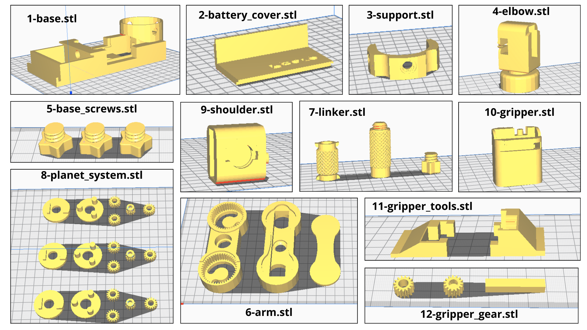

# Pedro Get Started

    

 

 

Welcome to the world of Pedro, the open-source robotics platform designed to make learning robotics, programming, and embedded electronics fun and accessible! Whether you’ve purchased a preassembled Pedro or you're building your own, here’s everything you need to get started.  

## ✅ How to Build your Pedro Robot ?

🛠️ To bring your Pedro robot to life, you’ll need:

- All the Pedro parts 
- Pedro Board Rev3 or Rev2
- 2 x ball bearings 8 x 22 x 7 mm
- 7.4V DC battery with 2 pins JST XH2.54 connector
- 4 x MS90 360° servo motors (not 180°)
- Micro USB cable
- Module Options:
    - NRF24L01
    - Screen OLED 128x64 0.96"
    - HC-05 (Rev3 only)
    - ESP8266-01 (Rev3 only)

    

## ✅ Step 1: 3D Printing

Print all the Pedro Parts (STL files availables on [Pedro GitHub Page](https://github.com/almtzr/Pedro/tree/main/gerber))

    

## ✅ Step 2: Assembling 

|  |  |
|---------------------------------------|---------------------------------------|

|   |  |
|---------------------------------------|---------------------------------------|

|  |  | 
|---------------------------------------|---------------------------------------|

|  |  | 
|---------------------------------------|---------------------------------------|

|  |  |
|---------------------------------------|---------------------------------------|

|  |  |
|---------------------------------------|---------------------------------------|

|  |  |
|---------------------------------------|---------------------------------------|

    

## ✅ Step 3: Programming

- Download [Arduino IDE](https://www.arduino.cc/en/software)
- Install the required libraries: Servo, Wire, Adafruit GFX, Adafruit SSD1306
- Connect the Pedro Board to the PC
- Select Arduino Pro Micro (ATmega32U4) as the target board
- Upload your custom sketch to the Pedro Board or one of the sketch available on the [Pedro Github Page](https://github.com/almtzr/Pedro/tree/main/code/basic)
  

    
    
For exemple with directMode sketch, you can control Pedro by using the button A0   to select an axis and the button A1 or A2 to rotate it.

### Explore More Control Modes

Pedro also supports control modes: 
- Radio (NRF24L01)
- Bluetooth (HC-05)
- and Wi-Fi (ESP8266-01)

The code for each mode is available on the [Pedro GitHub page](https://github.com/almtzr/Pedro/tree/main/code).  
Feel free to customize the code to match your needs and make Pedro truly yours! 🚀

    

## ✅ If you manufacture your own Robot Pedro board using the Gerber file.

Want to build Pedro from scratch? You can make your own Pedro Board by using the [Gerber file](https://github.com/almtzr/Pedro/tree/main/gerber).  
When you get your board, the microcontroller ATmega32u4 doesn’t have the correct bootloader yet, it's delivered with the factory bootloader. To make Pedro work with Arduino IDE, you first need to flash the Arduino Pro Micro bootloader into the Pedro board using the SPI pins as described below.

🛠️ What You Need:

- Your Pedro board (of course)
- PC with Arduino IDE installed
- An Arduino Pro Micro
- A Micro USB cable
- Some wires

📌 How to do it?:

- Open Arduino IDE
- Connect the Arduino Pro Micro to the PC
- Select Arduino Pro Micro (ATmega32U4) as the target board
- Upload the "File" -> "Exemple" -> "Arduino as ISP" sketch to the Arduino Pro Micro
- When the upload is done disconnect the Arduino Pro Micro from the PC
- Connect the SPI pins of the Pedro board to the Arduino Pro Micro as shown:
    - Pedro Board => Arduino Pro Micro
    - GND         =>      GND (black)
    - VCC         =>      VCC (red)
    - SCK         =>      15 (orange)
    - MI          =>      14 (purple)
    - MO          =>      16 (green)
    - RST         =>      10 (yellow)
- Re-Connect the Arduino Pro Micro to the PC
- Select Arduino Pro Micro (ATmega32U4) as the target board
- Go to Tools > Burn Bootloader

🎯 Once done, disconnect the SPI wiring, plug the Pedro board to the PC and check in "Tools > Port" to ensure the board is recognized by Arduino IDE.

    

## Resources & Community

🔍 Full Documentation → Pedro GitHub page  
🚀 Need help or want to improve Pedro? → Open an issue on GitHub or come to discuss with us on the [Pedro Discord](https://discord.gg/TxkWNPU3ES)

Pedro is 100% open-source, meaning you’re free to explore, modify, and share your own improvements!

🎉 Have fun & keep building awesome robots! 🤖

---

This version keeps the content engaging, easy to read, and informative. Let me know if you need any adjustments! 🚀

## Mapping Pedro Board & Arduino

| Pedro Board         | Arduino Pin | Function                  |
|---------------------|-------------|---------------------------|
| Servo 1             | D5          | PWM Signal                |
| Servo 2             | D6          | PWM Signal                |
| Servo 3             | D9          | PWM Signal                |
| Servo 4             | D10         | PWM Signal                |
| Button 1  (Up)      | A0          | Select Servo              |
| Button 2 (Right)    | A1          | Servo Rotation (forward)  |
| Button 3 (Left)     | A2          | Servo Rotation (backward) |
| LED Servo 1         | D13         | Servo 1 Indicator         |
| LED Servo 2         | D11         | Servo 2 Indicator         |
| LED Servo 3         | D8          | Servo 3 Indicator         |
| LED Servo 4         | D7          | Servo 4 Indicator         |
| NRF24L01 CE         | D4          | SPI Enable (Radio)        |
| NRF24L01 CSN        | D12         | SPI Chip Select (Radio)   |
| OLED Display (SDA)  | D2          | I2C Data                  |
| OLED Display (SCL)  | D3          | I2C Clock                 |
| HC-05 TX (Rev3 Only)| D0          | UART RX (Bluetooth)       |
| HC-05 RX (Rev3 Only)| D1          | UART TX (Bluetooth)       |
| ESP8266 TX (Rev3 Only)| D0        | UART RX (WiFi)            |
| ESP8266 RX (Rev3 Only)| D1        | UART TX (WiFi)            |
| Switch 1 (Middle)   | N/A         | Select Mode Radio, Bluetooth, WiFi |
| Switch 2 (Left)     | N/A         | Select Mode AT (HC-05)    |
| Pin A3              | A3          | Free                      |
| Pin A4              | A4          | Free                      |
| Pin A5              | A5          | Free                      |
| Pin RX              | RX          | Free                      |
| Pin TX              | TX          | Free                      |

